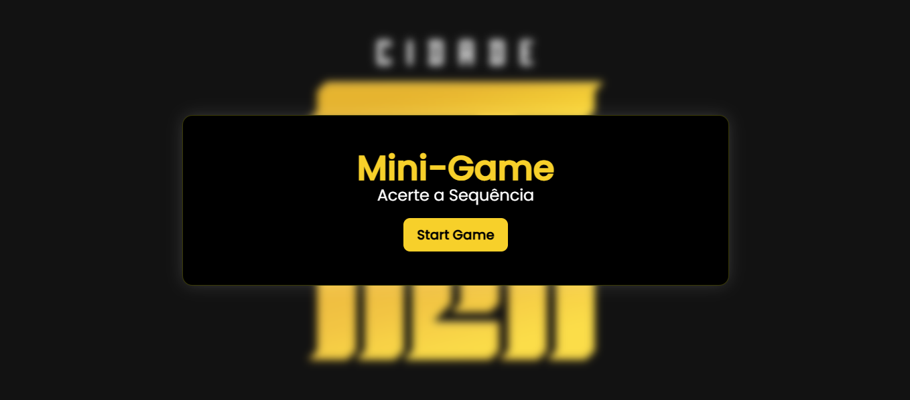
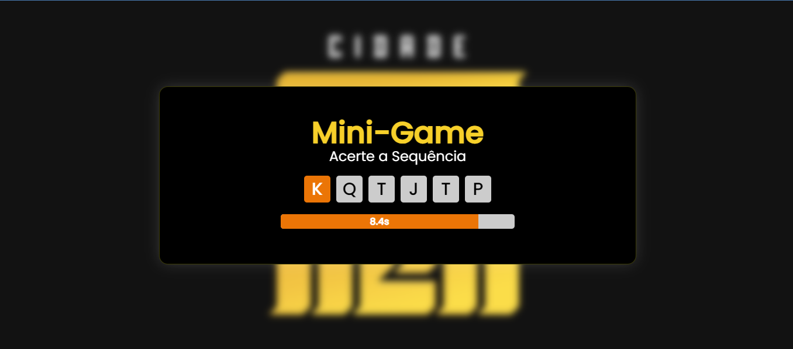
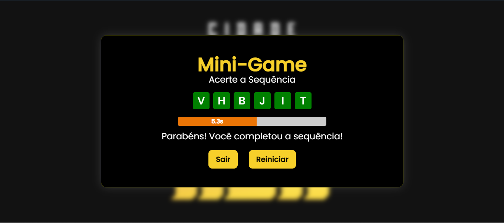
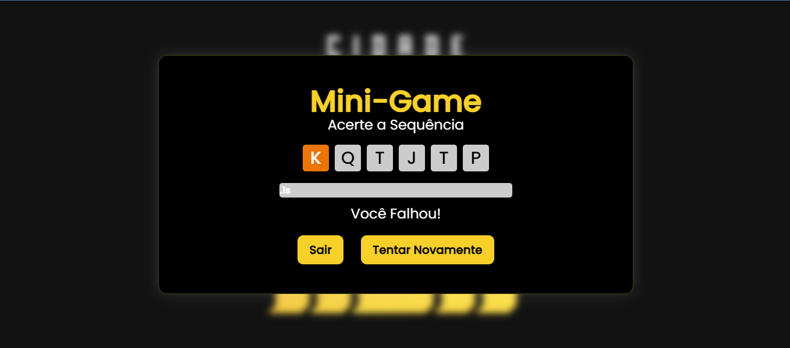

### Mini-Game Sequencia de Letras 

Este projeto é um mini-jogo de digitação desenvolvido com React e styled-components. O objetivo do jogo é testar a velocidade e precisão do jogador na digitação de sequências de letras aleatórias em um tempo limitado. O jogo proporciona feedback visual e auditivo ao jogador para indicar acertos e erros.

#### Funcionalidades Principais:

1. **Sequências Aleatórias de Letras:**
   - Ao iniciar o jogo, uma sequência de letras aleatórias é gerada. O jogador deve digitar essas letras na ordem correta.

2. **Cronômetro Regressivo:**
   - Um cronômetro visível na tela começa a contagem regressiva a partir de 6 segundos. A barra de tempo diminui gradualmente, indicando o tempo restante.

3. **Feedback Visual e Auditivo:**
   - Sons são tocados para indicar acertos e erros.
   - Quando o jogador erra uma tecla, a letra errada continua destacada em laranja para indicar onde ocorreu o erro.

4. **Reinício e Sair:**
   - Ao completar a sequência corretamente ou errar, o jogador pode optar por reiniciar o jogo ou sair.

5. **Interface Intuitiva:**
   - A interface é simples e clara, facilitando a compreensão e interação do jogador.

#### Instruções para Iniciar o Projeto:

1. **Instalação das Dependências:**
   - Execute `yarn` para instalar todas as dependências necessárias.

2. **Iniciar o Servidor de Desenvolvimento:**
   - Execute `yarn dev` para iniciar o servidor de desenvolvimento. O jogo estará disponível em `http://localhost:5173`.

3. **Personalização:**
   - Ajuste os estilos e sons conforme necessário para personalizar a experiência do jogo.

##

#### Motivação do Projeto:

Este projeto foi desenvolvido como parte de um teste para uma vaga de desenvolvedor front-end. A criação deste mini-jogo visa demonstrar habilidades em React, gerenciamento de estado, uso de styled-components para estilização dinâmica e integração de feedback auditivo e visual para melhorar a experiência do usuário.

### Contribuição

Contribuições são bem-vindas! Sinta-se à vontade para abrir issues ou enviar pull requests para melhorar o jogo, adicionar novas funcionalidades ou corrigir bugs.

##

### Deploy do Projeto

Teste sua Habilidade com o Mini-Game=> <a href="https://mini-game-cda.netlify.app/" target="_blank">Testar Habilidade</a>

### Demonstração

Aqui está uma breve demonstração visual do Mini-Game:
#### Tela de Start

#### Tela de Sequência Gerada

#### Tela de Sequência Correta

#### Tela de Sequência Incorreta

---
